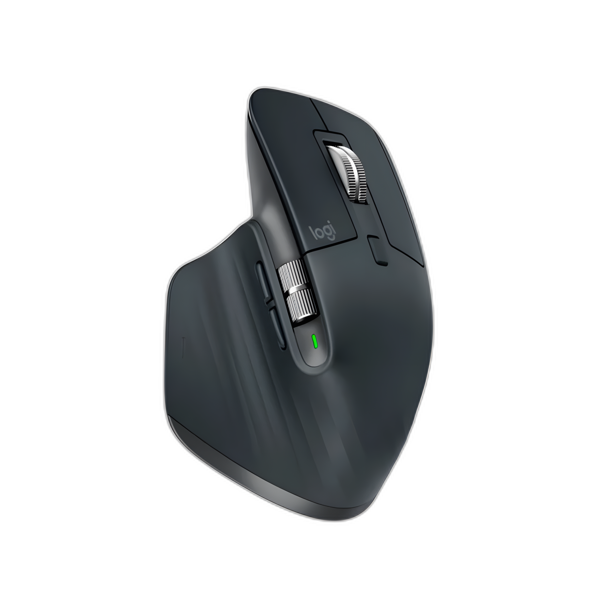

# makima-mx

A Quickshell-based UI for [makima](https://github.com/cyber-sushi/makima) — remap
your Logitech MX Master 3/3S buttons interactively, with per-app overrides and
named profiles per app.



## What it does

- Visual mouse with clickable buttons for rebinding
- Multi-key capture (e.g. Shift+/) with auto-save on release
- Named profiles per app (`Default`, `PvP`, `Skilling`, …)
- Per-app overrides (always-on; uses makima's `device::wm-class.toml` convention)
- Drag-to-reorder app pills · custom display names · custom icons
- Live status: active app (focused-window aware), makima daemon health, device
  connection
- Auto-themes to DMS / Matugen colors when available

## Requirements

**Required:**
- [makima](https://github.com/cyber-sushi/makima) — the daemon doing the actual
  remapping (`paru -S makima` or build from source)
- [quickshell](https://quickshell.outfoxxed.me) ≥ 0.3
- A Logitech MX Master 3 or 3S (other Logitech mice probably work but BTN code
  mappings may differ — see `MakimaService.qml > buttonCodeOf`)

**Recommended:**
- [DankMaterialShell](https://github.com/AvengeMedia/DankMaterialShell) — for
  live Matugen colors. Without it, makima-mx uses a built-in dark scheme.
- Hyprland — for the live "Active: <app>" indicator. Other Wayland compositors
  work for everything else; the status bar just won't show the focused app.

**Assumed:**
- makima runs as a user systemd service (`systemctl --user start makima`)
- Bash + `awk` available (used by the device-detection probe)

## Install

```sh
git clone https://github.com/<you>/makima-mx ~/projects/makima-mx
cd ~/projects/makima-mx
quickshell -p ./shell.qml
```

State lives in `$XDG_CONFIG_HOME/makima-mx/profiles.json` (defaults to
`~/.config/makima-mx/`). makima's per-device TOMLs are written to
`$XDG_CONFIG_HOME/makima/`.

The first time you save a binding, makima-mx will back up your existing global
TOML to `<deviceName>.toml.makima-mx-backup`.

## Device detection

On startup, makima-mx parses `/proc/bus/input/devices` looking for the first
entry whose Name contains `Logitech` or `MX Master` and that has a `mouseN`
handler. The Name field becomes the basename for makima's TOML files. If your
device shows under a different name (e.g. via a non-Logitech BT adapter), edit
`profiles.json` and set `deviceName` manually.

The probe re-runs every 5s, so unplugging or pairing the mouse updates the
top-right status dot live.

## Limitations

- **MX Master 3/3S only** — button mappings (`BTN_SIDE`/`BTN_EXTRA`/`BTN_FORWARD`)
  are hardcoded for these. The Mode-shift and Thumb-wheel buttons are not yet
  wired (need evtest output to identify their evdev codes).
- **Captures keyboard keys only** — chord combos like Shift+/ work; chaining
  modifier-only or mouse-button targets is TBD.
- **Light theme** — Theme.qml currently only reads DMS's `dark` palette. Switch
  to `light` would need a one-line change + mode detection.

## Layout / file map

| File | Purpose |
|---|---|
| `shell.qml` | App entry, top bar, layout, modal hosting |
| `MakimaService.qml` | State, persistence, TOML I/O, device probe, daemon probe |
| `MouseDisplay.qml` | Mouse image + clickable overlays |
| `BindingsList.qml` | Right-hand binding rows |
| `CaptureModal.qml` | Key-capture popup |
| `NameProfileModal.qml` | New-profile naming |
| `AppPickerModal.qml` | Add-app picker (lists current Hyprland windows) |
| `IconEditModal.qml` | Per-app icon + display-name editor |
| `Theme.qml` | Matugen-aware color singleton |
| `KeyMap.js` | Qt.Key_* → KEY_* mapping for makima |
| `assets/mouse.png` | Product shot (1000×1000 RGBA), upscaled with Real-ESRGAN |
| `assets/fonts/MaterialSymbolsRounded.ttf` | Material Symbols (for the globe icon) |

## License

Mouse image: Logitech product shot, included under fair use.
Material Symbols: Apache 2.0.
Code: MIT (or your choice).
